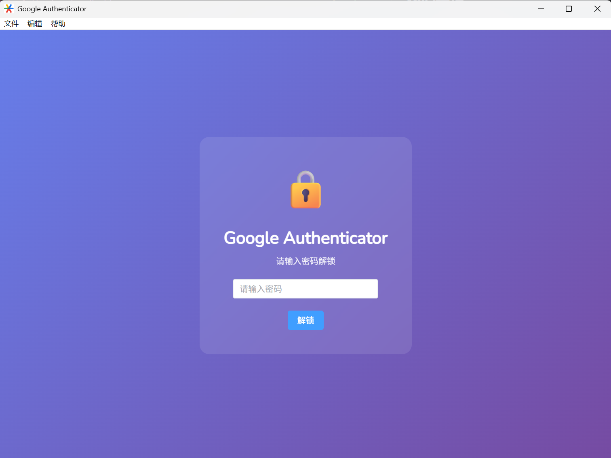
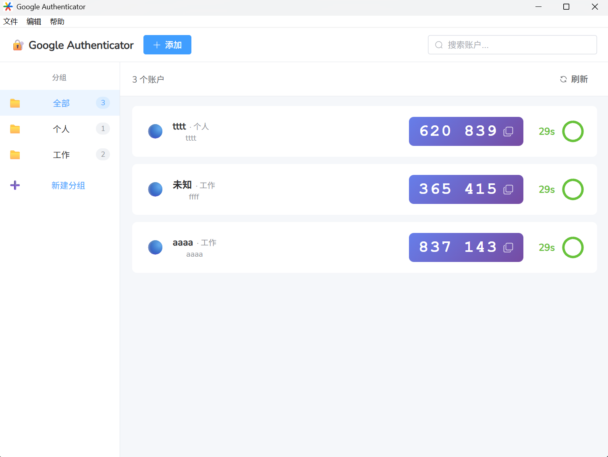

# Google Authenticator Desktop

一款安全、开源的桌面端双因素认证器，**完整兼容 Google Authenticator 迁移协议**。



---

## 设计背景

在寻找将 Google Authenticator 账户迁移到桌面端的解决方案时，发现市面上的工具存在以下问题：

- **在线工具**：需要将敏感的 TOTP 密钥上传到第三方服务器，存在泄露风险
- **命令行工具**：对普通用户不友好，操作繁琐
- **其他桌面端**：不支持 `otpauth-migration://` 批量迁移协议，不支持分组显示

**本项目的目标**：提供一个**完全离线、开源透明、支持原生迁移协议**的桌面解决方案，让用户可以安全地将手机上的 Google Authenticator 账户一键迁移到桌面端。

---

## 核心特性

### 完整迁移支持

| 协议 | 说明 | 支持 |
|-----|------|:----:|
| `otpauth-migration://` | Google Authenticator 导出的批量迁移二维码 | ✅ |
| `otpauth://totp/` | 标准 TOTP 单账户二维码 | ✅ |
| `otpauth://hotp/` | 标准 HOTP 单账户二维码 | ✅ |

### 功能一览

- **账户管理**：添加、删除、分组、搜索
- **验证码生成**：TOTP/HOTP，支持 6/8 位，SHA1/SHA256/SHA512/MD5
- **导入方式**：扫描二维码图片、剪贴板粘贴、手动输入
- **导出迁移**：生成标准迁移二维码，可导回手机端
- **系统托盘**：关闭窗口最小化到托盘，后台常驻
- **主题切换**：浅色 / 深色 / 跟随系统

---

## 安全设计

### 本地存储加密

所有敏感数据（TOTP 密钥、账户信息）均使用 **AES-256-GCM** 认证加密存储在本地 SQLite 数据库中，**绝不上传任何数据**。

```
数据流: 明文 → AES-256-GCM 加密 → Base64 编码 → SQLite
```

### 密钥派生

采用 **Argon2id** 算法（2015年密码哈希竞赛冠军）从用户密码派生加密密钥：

| 参数 | 值 | 说明 |
|-----|---|------|
| 内存消耗 | 64 MB | 抵抗 GPU/ASIC 暴力破解 |
| 迭代次数 | 1 | 平衡安全与性能 |
| 并行度 | 4 | 利用多核 CPU |
| 输出长度 | 32 字节 | AES-256 密钥 |

### 设备绑定

未设置密码时，使用**设备唯一标识**（主机名 + 用户目录 + 系统信息）生成加密密钥，数据库文件复制到其他设备无法解密。

### 密码保护

- 可选启用密码保护
- 支持自动锁定（1-30 分钟无操作）
- 密码验证失败不泄露任何信息

---

## 技术栈

| 层级 | 技术 |
|-----|------|
| 后端 | Go 1.21+ |
| 前端 | Vue 3 + Element Plus |
| 框架 | Wails v2 |
| 数据库 | SQLite (modernc.org/sqlite, 纯 Go) |
| 加密 | AES-256-GCM + Argon2id |
| 二维码 | goqr + gozxing (多算法容错) |

---

## 快速开始

### 从源码构建

```bash
# 安装 Wails CLI
go install github.com/wailsapp/wails/v2/cmd/wails@latest

# 克隆项目
git clone https://github.com/yourname/google-authenticator-desktop.git
cd google-authenticator-desktop

# 开发模式
wails dev

# 构建发布版
wails build
```

### 使用方法

1. **迁移账户**：在手机 Google Authenticator 中选择「导出账户」，截图或拍照保存二维码
2. **导入桌面**：菜单「文件  → 转移验证码  → 导入迁移码」，选择图片或从剪贴板粘贴
3. **设置密码**：菜单「编辑  → 设置」启用密码保护（推荐）

---

## 项目结构

```
google-authenticator/
├── main.go                 # 入口 + 系统托盘
├── app.go                  # 后端 API
├── internal/
│   ├── storage/            # 数据存储层
│   │   ├── database.go     # SQLite 操作
│   │   └── crypto.go       # AES-256-GCM + Argon2id
│   ├── otp/                # OTP 算法
│   │   └── otp.go          # TOTP/HOTP 生成
│   ├── migration/          # 迁移协议
│   │   ├── migration.go    # otpauth:// 解析
│   │   └── parser.go       # otpauth-migration:// 解析
│   └── qrcode/             # 二维码处理
│       └── qrcode.go       # 扫描 + 生成
└── frontend/               # Vue 3 前端
    └── src/App.vue
```

---

## 安全声明

- 所有数据**仅存储在本地**，不包含任何网络请求（除用户主动访问外部链接）
- 加密实现使用 Go 标准库和经过广泛审计的 `golang.org/x/crypto`
- **请妥善备份**：如果忘记密码且未导出账户，数据将无法恢复

---

## 许可证

MIT License

---

## 致谢

- [Wails](https://wails.io/) - 优秀的 Go + Web 桌面框架
- [Element Plus](https://element-plus.org/) - Vue 3 UI 组件库
- [dim13/otpauth](https://github.com/dim13/otpauth) - 迁移协议参考实现

---

**by rabbitmask © 2025**
